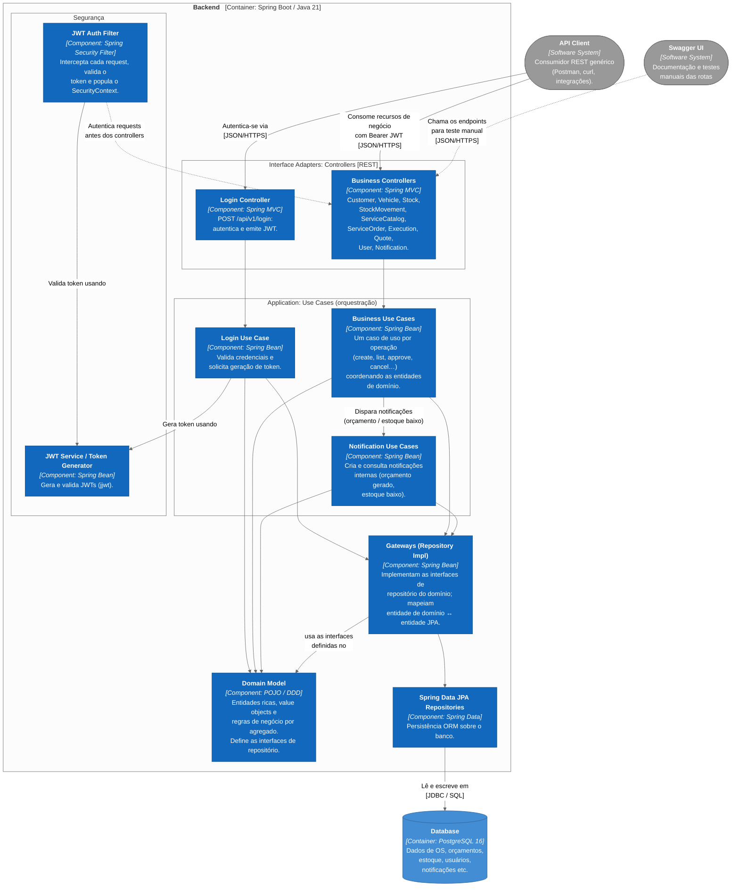

# Diagrama de Componentes - Ofisy

Diagrama de componentes do
**container Backend** da aplicação Ofisy (Spring Boot / Java 21), usando Clean Architecture.

São 10 agregados de negócio: Customer, Vehicle, Stock, StockMovement, ServiceCatalog,
ServiceOrder, ServiceOrderExecution, Quote, User e Notification. Todos seguem o mesmo caminho de
camadas `Controller → Use Case → Gateway`. Desenhar os 10 separadamente só polui o diagrama, então
eles aparecem agrupados em um bloco só. À parte disso, dois mecanismos têm lógica própria e
merecem caixa dedicada: a autenticação via JWT e as notificações internas.

## Componentes

| Componente                        | Tecnologia             | Responsabilidade                                                                                                                                                                                                                     |
|-----------------------------------|------------------------|--------------------------------------------------------------------------------------------------------------------------------------------------------------------------------------------------------------------------------------|
| **Login Controller**              | Spring MVC             | Endpoint de autenticação (`POST /api/v1/login`); delega ao caso de uso de login.                                                                                                                                                     |
| **Business Controllers**          | Spring MVC             | Um controller por agregado (Customer, Vehicle, Stock, StockMovement, ServiceCatalog, ServiceOrder, ServiceOrderExecution, Quote, User, Notification). Expõem as rotas REST e delegam a casos de uso. Protegidos por `@PreAuthorize`. |
| **Login Use Case**                | Spring Bean            | Valida credenciais (senha via `PasswordEncoder`) e solicita a emissão do token.                                                                                                                                                      |
| **Business Use Cases**            | Spring Bean            | Um caso de uso por operação (create, list, approve, cancel, startDiagnostic…). Coordenam as entidades de domínio e os gateways.                                                                                                      |
| **Notification Use Cases**        | Spring Bean            | Criam e consultam notificações internas. Outros casos de uso os chamam direto, no mesmo processo, quando geram um orçamento ou detectam estoque baixo. As notificações ficam no banco; nesta fase não sai e-mail nem SMS.           |
| **Domain Model**                  | POJO / DDD             | Entidades ricas, value objects (ex.: `Email`, `CpfCnpj`, `LicensePlate`) e regras de negócio. Define as interfaces de repositório.                                                                                                   |
| **JWT Auth Filter**               | Spring Security Filter | Intercepta cada requisição, valida o Bearer token e popula o `SecurityContext`.                                                                                                                                                      |
| **JWT Service / Token Generator** | Spring Bean (jjwt)     | Geração e validação dos tokens JWT.                                                                                                                                                                                                  |
| **Gateways (Repository Impl)**    | Spring Bean            | Implementam as interfaces de repositório do domínio e mapeiam domínio ↔ entidade JPA.                                                                                                                                                |
| **Spring Data JPA Repositories**  | Spring Data            | Persistência ORM.                                                                                                                                                                                                                    |

## Containers relacionados

| Container            | Tecnologia        | Papel                                                                         |
|----------------------|-------------------|-------------------------------------------------------------------------------|
| **Database**         | PostgreSQL 16     | Persistência relacional. Schema versionado via Flyway (ver `docs/FLYWAY.md`). |
| **API Client**       | (n/a)             | Consumidor REST genérico (Postman, curl, integrações).                        |
| **Swagger UI**       | springdoc-openapi | Documentação interativa das rotas.                                            |