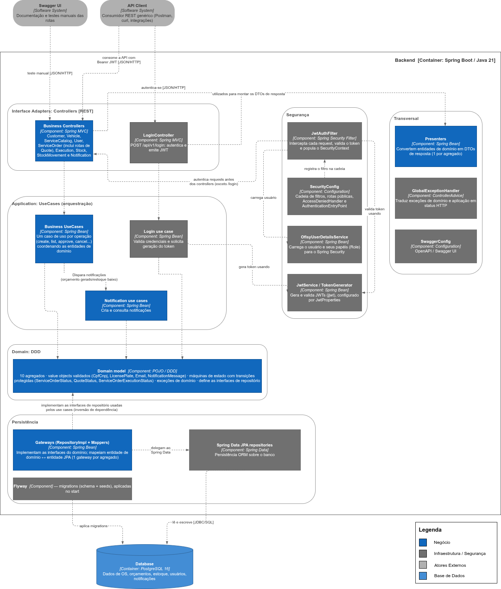

# Diagrama de Componentes - Ofisy

Diagrama de componentes do
**container Backend** da aplicação Ofisy (Spring Boot / Java 21), usando Clean Architecture.

São 10 agregados de negócio: Customer, Vehicle, Stock, StockMovement, ServiceCatalog,
ServiceOrder, ServiceOrderExecution, Quote, User e Notification. Todos seguem o mesmo caminho de
camadas `Controller → Use Case → Gateway`. Desenhar os 10 separadamente só polui o diagrama, então
eles aparecem agrupados em um bloco só. À parte disso, dois mecanismos têm lógica própria e
merecem caixa dedicada: a autenticação via JWT e as notificações internas.

