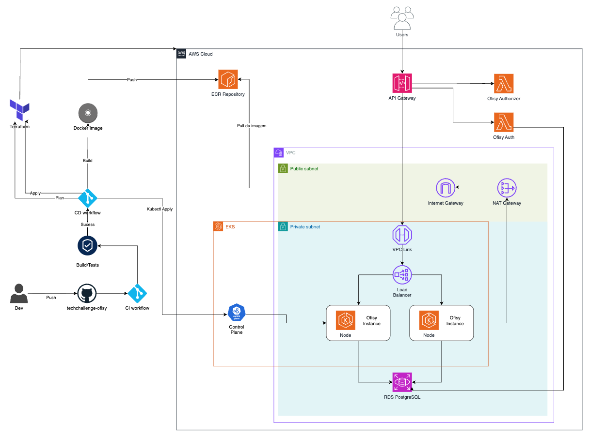

# Diagrama de Infraestrutura e CI/CD - Ofisy

Diagrama de infraestrutura (deployment) e de CI/CD da aplicação Ofisy na AWS: como o
container Backend documentado em `docs/COMPONENT-DIAGRAM.md` roda, é exposto e persiste
dados em produção, e como o pipeline de CI/CD (detalhado mais abaixo) leva o código até
esse ambiente.

A aplicação roda num cluster EKS dentro de uma VPC dedicada, com os nós de trabalho na
subnet privada. Quem entra vindo da internet chega pelo API Gateway, que valida a
requisição com o Ofisy Authorizer (Lambda) e a encaminha por um VPC Link até o Load
Balancer na subnet privada, de forma que os nós do EKS não ficam expostos diretamente à
internet. Quem sai (por exemplo, o pull de imagem no ECR) passa pelo NAT Gateway e pelo
Internet Gateway. O banco fica num RDS PostgreSQL, acessível a partir da subnet privada.

A autenticação de clientes por CPF é feita fora do cluster, pela Lambda Ofisy Auth, que
consulta o mesmo RDS e devolve o JWT usado nas chamadas seguintes.

## Componentes

| Componente              | Tecnologia                  | Responsabilidade                                                                                                                    |
|-------------------------|-----------------------------|-------------------------------------------------------------------------------------------------------------------------------------|
| **API Gateway**         | Amazon API Gateway          | Ponto de entrada das requisições dos usuários; valida o acesso via Ofisy Authorizer e encaminha o tráfego para dentro da VPC.       |
| **Ofisy Authorizer**    | AWS Lambda                  | Authorizer acionado pelo API Gateway a cada requisição; valida o JWT e autoriza (ou nega) o acesso às rotas protegidas.             |
| **Ofisy Auth**          | AWS Lambda                  | Autenticação de clientes por CPF; consulta o RDS PostgreSQL e devolve o JWT usado nas chamadas seguintes.                           |
| **VPC Link**            | API Gateway VPC Link        | Conexão privada entre o API Gateway e o Load Balancer na VPC, sem expor os nós do EKS à internet.                                   |
| **Internet Gateway**    | AWS Internet Gateway        | Liga a VPC à internet; no fluxo atual atende principalmente à saída, como o pull da imagem no ECR via NAT Gateway.                  |
| **Load Balancer**       | AWS Load Balancer           | Recebe o tráfego vindo do VPC Link na subnet privada e distribui entre os nós/pods do backend no EKS.                               |
| **NAT Gateway**         | AWS NAT Gateway             | Permite que recursos na subnet privada (nós do EKS) iniciem conexões de saída à internet, como o pull da imagem no ECR.             |
| **EKS**                 | Amazon EKS (Kubernetes)     | Cluster que orquestra os pods (Ofisy Instance/Node) do backend, replicados em pelo menos duas instâncias para alta disponibilidade. |
| **Ofisy Instance/Node** | Pod (Spring Boot / Java 21) | Executa o container do backend descrito em `docs/COMPONENT-DIAGRAM.md`; escala horizontalmente conforme carga.                      |
| **ECR Repository**      | Amazon ECR                  | Registro privado da imagem Docker do backend, usada no deploy dos nós do EKS.                                                       |
| **RDS PostgreSQL**      | Amazon RDS (PostgreSQL)     | Banco de dados relacional gerenciado, na subnet privada, acessado pelos pods do backend e pela Lambda Ofisy Auth.                   |

## Subnets e segurança de rede

| Subnet             | Conteúdo                                     | Exposição                                                                                 |
|--------------------|----------------------------------------------|-------------------------------------------------------------------------------------------|
| **Public subnet**  | Internet Gateway, NAT Gateway                | Ligada à internet; atende à saída dos recursos privados (ex.: pull de imagem do ECR).     |
| **Private subnet** | VPC Link, Load Balancer, EKS (nós/pods), RDS | Sem IP público; a entrada só chega via API Gateway/VPC Link e a saída só via NAT Gateway. |

O único ponto de entrada externo é o API Gateway, que fica fora da VPC e alcança o Load
Balancer pelo VPC Link.

## Relação com o diagrama de componentes

Cada Ofisy Instance/Node aqui é uma réplica do container Backend detalhado em
`docs/COMPONENT-DIAGRAM.md` (Controllers, Use Cases, Domain, Gateways etc.). O
PostgreSQL 16 citado naquele diagrama é o mesmo RDS PostgreSQL representado aqui.

A autenticação de clientes por CPF, porém, não roda dentro desse container: ela fica na
Lambda Ofisy Auth, num repositório próprio (ver a seção de arquitetura da Fase 3 no
README). O backend no EKS recebe as requisições já autorizadas pelo API Gateway, e
segue tratando por conta própria a autenticação JWT das APIs administrativas.

## Pipeline de CI/CD

O deploy roda em duas pipelines encadeadas: primeiro o CI, e só se ele passar o CD é
disparado.

1. Dev faz push no repositório `techchallenge-ofisy` (GitHub).
2. O CI workflow sobe e roda o Build/Tests.
3. Se der sucesso, o CD workflow dispara em sequência. Se falhar, para ali e o CD nem
   roda.
4. O CD builda a Docker Image e dá push pro ECR Repository.
5. O Terraform gera o Plan e, aprovado, roda o Apply pra provisionar/atualizar a infra
   na AWS (VPC, EKS, Load Balancer, NAT Gateway, RDS etc).
6. Por fim, o CD roda Kubectl Apply no Control Plane do EKS, atualizando os pods
   (Ofisy Instance/Node) com a nova imagem, que é puxada do ECR via Internet Gateway.

| Etapa         | Ferramenta     | O que faz                                                                                   |
|---------------|----------------|---------------------------------------------------------------------------------------------|
| CI workflow   | GitHub Actions | Dispara build e testes a cada push.                                                         |
| Build/Tests   | GitHub Actions | Compila e testa a aplicação; decide se a pipeline avança pro CD.                            |
| CD workflow   | GitHub Actions | Só roda se o CI passar; builda/publica a imagem e aplica os manifests no EKS.               |
| Docker Image  | Docker         | Imagem do backend construída no CD e enviada (push) pro ECR Repository.                     |
| Terraform     | Terraform      | Gera o plan e roda o apply da infra AWS (VPC, EKS, RDS) a partir dos repositórios de infra. |
| Kubectl Apply | kubectl        | Aplica os manifests no Control Plane do EKS, atualizando os pods com a nova imagem do ECR.  |