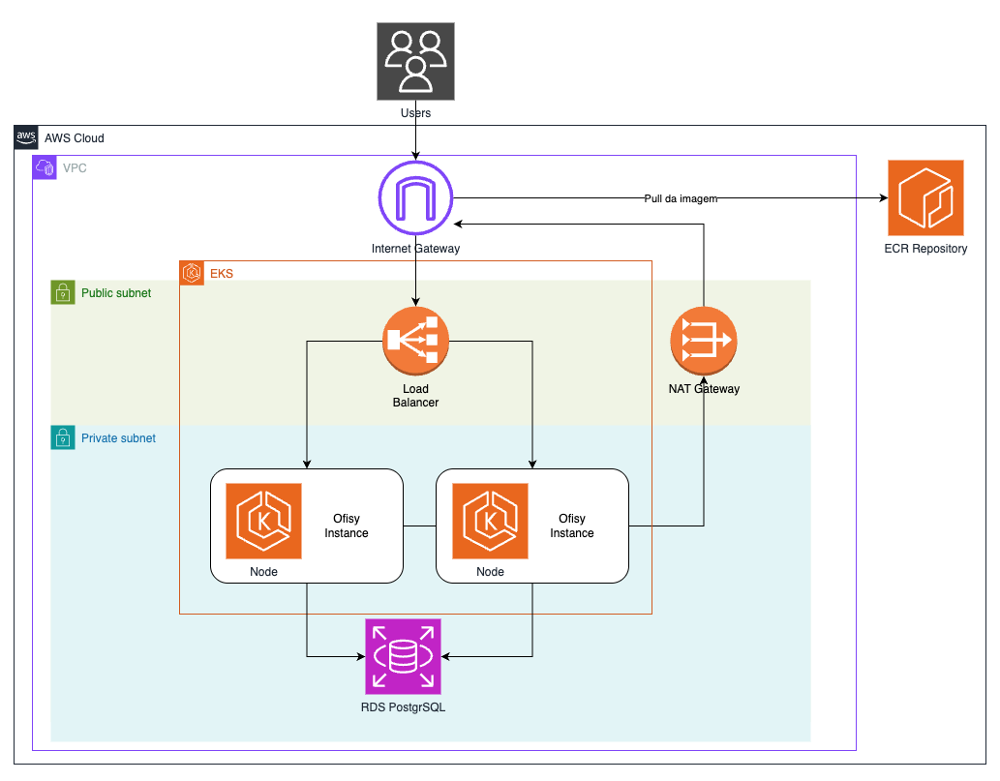

# Diagrama de Infraestrutura - Ofisy

Diagrama de infraestrutura (deployment) da aplicação Ofisy na AWS: como o container
Backend documentado em `docs/COMPONENT-DIAGRAM.md` roda, é exposto e persiste dados em
produção.

A aplicação roda num cluster EKS dentro de uma VPC dedicada, com os nós de trabalho na
subnet privada. Quem entra vindo da internet passa por um Load Balancer na subnet
pública; quem sai (por exemplo, o pull de imagem no ECR) passa pelo NAT Gateway. O banco
fica num RDS PostgreSQL, acessível a partir da subnet privada.

## Componentes

| Componente              | Tecnologia                  | Responsabilidade                                                                                                                    |
|-------------------------|-----------------------------|-------------------------------------------------------------------------------------------------------------------------------------|
| **Internet Gateway**    | AWS Internet Gateway        | Ponto único de entrada e saída de tráfego entre a VPC e a internet.                                                                 |
| **Load Balancer**       | AWS Load Balancer           | Recebe as requisições dos usuários na subnet pública e distribui entre os nós/pods do backend no EKS.                               |
| **NAT Gateway**         | AWS NAT Gateway             | Permite que recursos na subnet privada (nós do EKS) iniciem conexões de saída à internet, como o pull da imagem no ECR.             |
| **EKS**                 | Amazon EKS (Kubernetes)     | Cluster que orquestra os pods (Ofisy Instance/Node) do backend, replicados em pelo menos duas instâncias para alta disponibilidade. |
| **Ofisy Instance/Node** | Pod (Spring Boot / Java 21) | Executa o container do backend descrito em `docs/COMPONENT-DIAGRAM.md`; escala horizontalmente conforme carga.                      |
| **ECR Repository**      | Amazon ECR                  | Registro privado da imagem Docker do backend, usada no deploy dos nós do EKS.                                                       |
| **RDS PostgreSQL**      | Amazon RDS (PostgreSQL)     | Banco de dados relacional gerenciado, na subnet privada, acessado pelos pods do backend.                                            |

## Subnets e segurança de rede

| Subnet             | Conteúdo                       | Exposição                                                                             |
|--------------------|--------------------------------|---------------------------------------------------------------------------------------|
| **Public subnet**  | Load Balancer, NAT Gateway     | Acessível pela internet via Internet Gateway; único ponto de entrada externo.         |
| **Private subnet** | EKS (nós/pods), RDS PostgreSQL | Sem IP público; saída à internet apenas via NAT Gateway (ex.: pull de imagem do ECR). |

## Relação com o diagrama de componentes

Cada Ofisy Instance/Node aqui é uma réplica do container Backend detalhado em
`docs/COMPONENT-DIAGRAM.md` (Controllers, Use Cases, Domain, Gateways etc.). O
PostgreSQL 16 citado naquele diagrama é o mesmo RDS PostgreSQL representado aqui.