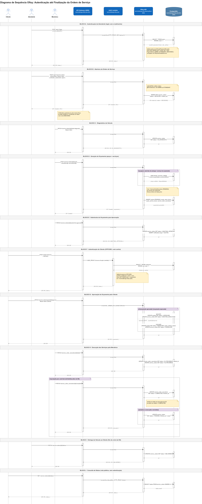

# Diagrama de Sequência - Ofisy

Diagrama de sequência que documenta o fluxo de ponta a ponta da aplicação Ofisy: desde a
autenticação de cada ator até a finalização da ordem de serviço (OS).

Três atores envolvidos: **Cliente**, **Atendente** e **Mecânico** 
Quatro componentes de infraestrutura envolvidos: o **API Gateway**, a **Lambda de autenticação**
(`techchallenge-ofisy-auth`), a **API Ofisy** (`techchallenge-ofisy`, rodando no EKS) e o
**PostgreSQL** (RDS, `techchallenge-ofisy-rds-infra`). 

O fluxo está organizado em 10 blocos
sequenciais: login do Atendente, abertura da OS, diagnóstico, geração de orçamento, submissão
para aprovação, autenticação do Cliente via CPF/CNPJ, aprovação do orçamento, execução dos
serviços, finalização automática da OS (quando todas as execuções ficam `COMPLETED`) e entrega do
veículo. Cada um deles indicando o endpoint chamado, o componente responsável e a interação com o
banco de dados.

